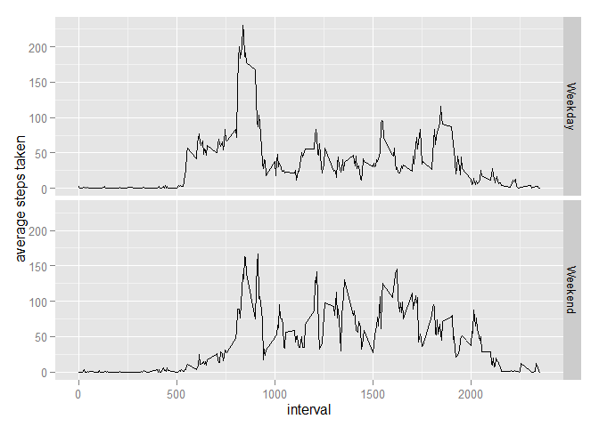

# Reproducible Research: Peer Assessment 1


## Loading and preprocessing the data

Read activity.csv file from working directory

```r
activity <- read.csv("./activity.csv")
```
Load required packages

```r
library(lubridate)
```

```
## Warning: package 'lubridate' was built under R version 3.1.3
```

```r
library(ggplot2)
```

```
## Warning: package 'ggplot2' was built under R version 3.1.3
```
Change format of date variable

```r
activity$date <- ymd(as.character(activity$date))
```

## What is mean total number of steps taken per day?

Total number of steps taken per day:

```r
aggregate(steps ~ date, data=activity, sum)
```

```
##          date steps
## 1  2012-10-02   126
## 2  2012-10-03 11352
## 3  2012-10-04 12116
## 4  2012-10-05 13294
## 5  2012-10-06 15420
## 6  2012-10-07 11015
## 7  2012-10-09 12811
## 8  2012-10-10  9900
## 9  2012-10-11 10304
## 10 2012-10-12 17382
## 11 2012-10-13 12426
## 12 2012-10-14 15098
## 13 2012-10-15 10139
## 14 2012-10-16 15084
## 15 2012-10-17 13452
## 16 2012-10-18 10056
## 17 2012-10-19 11829
## 18 2012-10-20 10395
## 19 2012-10-21  8821
## 20 2012-10-22 13460
## 21 2012-10-23  8918
## 22 2012-10-24  8355
## 23 2012-10-25  2492
## 24 2012-10-26  6778
## 25 2012-10-27 10119
## 26 2012-10-28 11458
## 27 2012-10-29  5018
## 28 2012-10-30  9819
## 29 2012-10-31 15414
## 30 2012-11-02 10600
## 31 2012-11-03 10571
## 32 2012-11-05 10439
## 33 2012-11-06  8334
## 34 2012-11-07 12883
## 35 2012-11-08  3219
## 36 2012-11-11 12608
## 37 2012-11-12 10765
## 38 2012-11-13  7336
## 39 2012-11-15    41
## 40 2012-11-16  5441
## 41 2012-11-17 14339
## 42 2012-11-18 15110
## 43 2012-11-19  8841
## 44 2012-11-20  4472
## 45 2012-11-21 12787
## 46 2012-11-22 20427
## 47 2012-11-23 21194
## 48 2012-11-24 14478
## 49 2012-11-25 11834
## 50 2012-11-26 11162
## 51 2012-11-27 13646
## 52 2012-11-28 10183
## 53 2012-11-29  7047
```

Histogram of the total number of steps taken each day:

```r
stepsbyday <- aggregate(steps ~ date, data=activity, sum)
qplot(steps, data=stepsbyday, xlab="total steps per day", ylab="number of days")
```

```
## stat_bin: binwidth defaulted to range/30. Use 'binwidth = x' to adjust this.
```

 

Mean of the total number of steps taken per day:

```r
mean(stepsbyday$steps)
```

```
## [1] 10766.19
```

Median of the total number of steps taken per day:

```r
median(stepsbyday$steps)
```

```
## [1] 10765
```

## What is the average daily activity pattern?

Time series plot of the 5-minute interval, and the average number of steps taken, averaged across all days:

```r
timeseries <- aggregate(steps ~ interval, data=activity, mean)
g <- ggplot(timeseries, aes(interval, steps))
g + geom_line() + ylab("average steps taken")
```

 

Which 5-minute interval contains the maximum number of steps?

```r
timeseries[which.max(timeseries$steps),]
```

```
##     interval    steps
## 104      835 206.1698
```

## Imputing missing values

Total number of missing values in the dataset:

```r
sum(is.na(activity))
```

```
## [1] 2304
```

Create a new dataset (activity_imp) that is equal to the original dataset but with missing values for steps replaced by the mean value for that 5-minute interval:

```r
activity_imp <- activity
activity_imp$meansteps_int <- with(activity_imp, ave(steps, interval, FUN=function(x) mean(x, na.rm=TRUE)))
activity_imp$steps[is.na(activity_imp$steps)] = activity_imp$meansteps_int
```

```
## Warning in activity_imp$steps[is.na(activity_imp$steps)] = activity_imp
## $meansteps_int: number of items to replace is not a multiple of replacement
## length
```

Histogram of the total number of steps taken per day, after imputation:

```r
stepsbyday_imp <- aggregate(steps ~ date, data=activity_imp, sum)
qplot(steps, data=stepsbyday_imp, xlab="total steps per day", ylab="number of days")
```

```
## stat_bin: binwidth defaulted to range/30. Use 'binwidth = x' to adjust this.
```

 

Mean of the total number of steps taken per day, after imputation:

```r
mean(stepsbyday_imp$steps)
```

```
## [1] 10766.19
```
There is no impact of imputation on the mean number of steps per day

Median of the total number of steps taken per day, after imputation:

```r
median(stepsbyday_imp$steps)
```

```
## [1] 10766.19
```
There is a slight increase in median number of steps per day after imputation

## Are there differences in activity patterns between weekdays and weekends?

Create a new factor variable in the dataset (weekday) indicating whether the given date is a weekday or weekend:

```r
activity_imp$weekday <- as.factor(ifelse(weekdays(activity_imp$date) %in% c("Saturday", "Sunday"), "Weekend", "Weekday"))
```

Panel plot containing a time series plot of the 5-minut interval and the average number of steps taken, averaged across all weekday days or weekend days:

```r
timeseries_imp <- aggregate(steps ~ interval + weekday, data=activity_imp, mean)
g <- ggplot(timeseries_imp, aes(interval, steps))
g + geom_line() + facet_grid(weekday ~ .) + ylab("average steps taken")
```

 
